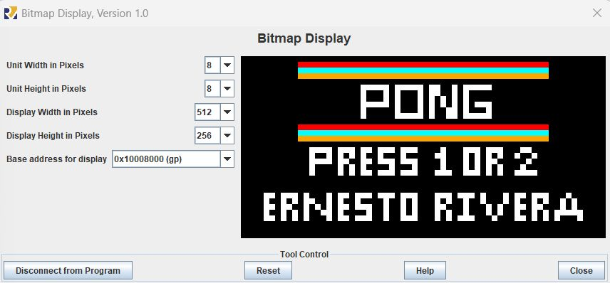
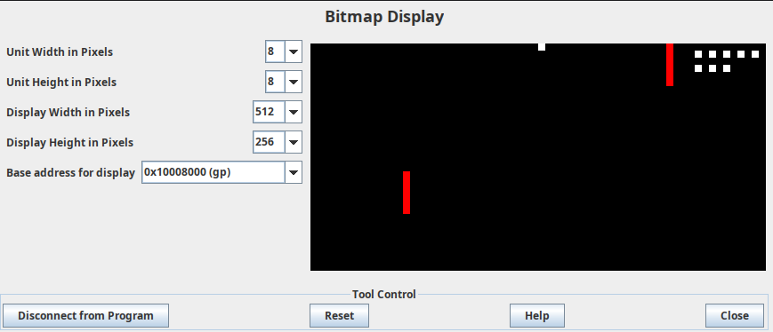

## ✨ Overview
Welcome to **RISC-V Pong**, a retro-inspired game built entirely in **RISC-V Assembly** using the **RARS simulator**. This project showcases low-level programming concepts like memory-mapped graphics, input handling, and game logic — all without high-level abstractions! 🚀

## 🌟 Features
- 🕹️ **Two-player mode**: Press `1` or `2` to start the game.
- 🖼️ **Bitmap Display**: Uses RARS Bitmap Display tool for rendering graphics.
- ⚡ **Pure Assembly**: No external libraries, just raw RISC-V instructions.
- 🎯 **Dynamic Gameplay**: Ball movement, collision detection, and paddle control implemented at the instruction level.

## 🛠️ Requirements
- ✅ **RARS**: Download from [RARS GitHub](https://github.com/TheThirdOne/rars).
- ✅ Enable **Bitmap Display** in RARS:
  - 🔳 Unit Width: `8`
  - 🔳 Unit Height: `8`
  - 📐 Display Width: `512`
  - 📐 Display Height: `256`
  - 🗂️ Base Address: `0x10008000 (gp)`

## 🚀 How to Run
1. 📥 Clone the repository:
   ```bash
   git clone https://github.com/ernestoriv7/risc-v-pong-rars.git
   ```
2. 🖥️ Open the `.asm` file in **RARS**.
3. 🖼️ Enable **Bitmap Display** and set the parameters as shown above.
4. ▶️ Assemble and run the program.
5. 🎉 Enjoy Pong in RISC-V assembly!

## 🎮 Controls
- 👤 **Player 1**: `W` (up), `S` (down)
- 👤 **Player 2**: `↑` (up), `↓` (down)

## 🖼️ Screenshots
### 🏁 Start Screen


### 🏓 Gameplay


## 💡 Why This Project?
This game is a practical example for:
- 📚 Learning **RISC-V architecture**.
- 🎨 Understanding **low-level graphics programming**.
- 🕹️ Exploring **game logic in assembly**.

## 📜 License
MIT License. Feel free to use, modify, and share. ✅
